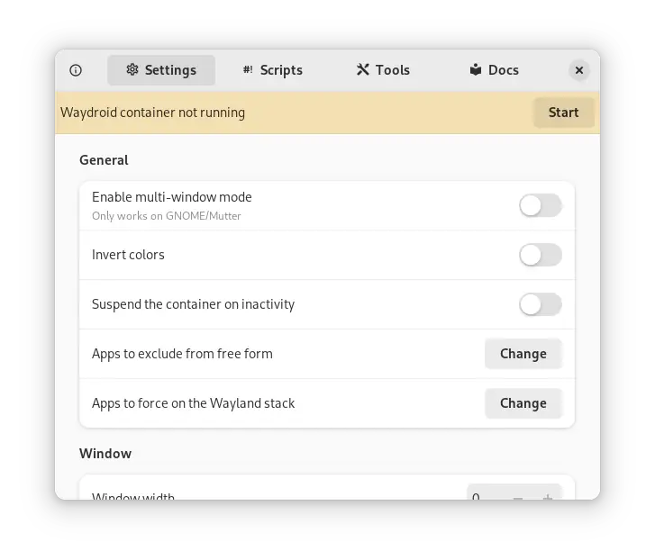

  <h1>Waydroid Settings</h1>
  A GTK4 app to control Waydroid settings

## Building:

- **Requirements**

 <i>webkit2gtk5</i>
 
 <i>vte4</i>

- **Build**

 <i>meson build --prefix=/usr</i>

 <i>cd build</i>

 <i>sudo ninja install</i>
